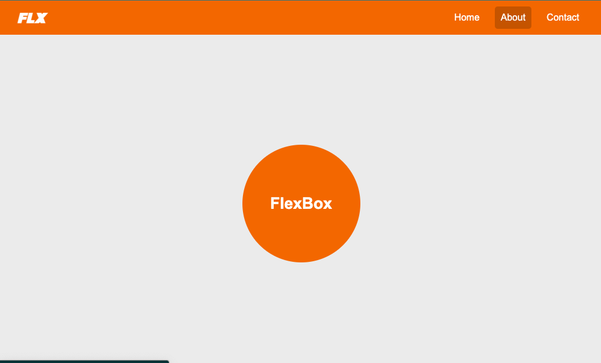

# 🌟 Ejercicio: Convertir Layout a Flexbox

## 🎯 Objetivo

El objetivo de este ejercicio es tomar un archivo HTML proporcionado y aplicar estilos con **CSS utilizando Flexbox** para que el diseño final se parezca al layout mostrado en la imagen.



## 🚀 Pasos a seguir

1. **Usar el template del repositorio**

   - Haz una copia de repositorio con el botón "Use this template" en la parte superior de esta página.
   - Esto creará un nuevo repositorio en tu cuenta de GitHub basado en el template.
   - Luego, clona tu repositorio en tu entorno local utilizando Git:
     ```bash
     git clone https://github.com/tu_usuario/tu_repositorio.git
     ```

2. **Modificación del archivo CSS**

   - Aplica las propiedades de **Flexbox** en el archivo CSS para lograr que el layout se parezca al mostrado en la imagen de referencia.
   - Puedes hacer ajustes en el archivo HTML si es necesario para lograr el diseño deseado.

3. **Requisitos de diseño**:

   - El **navbar** debe estar alineado horizontalmente con sus elementos distribuidos equitativamente y centrados verticalmente.
   - El contenido principal debe estar **centrado vertical y horizontalmente** en la pantalla, mostrando un círculo con texto dentro de él, tal como se muestra en la imagen.
   - Asegúrate de que el diseño sea **responsivo** utilizando Flexbox.

4. **Commits semánticos** 📋

   - Realiza commits **semánticos** para cada tarea o avance que completes. Esto significa que cada commit debe ser descriptivo y claro sobre qué cambio hiciste.

5. **Sube tu progreso a GitHub** 🚀

   - Sube tu trabajo al repositorio en GitHub.
     ```bash
     git add .
     git commit -m "feat: your commit message"
     git push
     ```

---

## 🔑 Puntos importantes

- **Uso de Flexbox**: Asegúrate de que la mayor parte del diseño esté centrado utilizando **Flexbox**. Los contenedores y elementos hijos deben aprovechar las propiedades como `justify-content`, `align-items`.
- **Responsividad**: El diseño debe funcionar tanto en pantallas grandes como pequeñas.

- **Commits semánticos**: Tus commits deben ser descriptivos y claros, de acuerdo a lo que modificas o agregas.

## 📚 Recursos útiles

- [Guía completa de Flexbox](https://css-tricks.com/snippets/css/a-guide-to-flexbox/)
- [Documentación de MDN sobre Flexbox](https://developer.mozilla.org/es/docs/Web/CSS/CSS_Flexible_Box_Layout/Basic_Concepts_of_Flexbox)

¡Buena suerte y feliz codificación! 🚀
